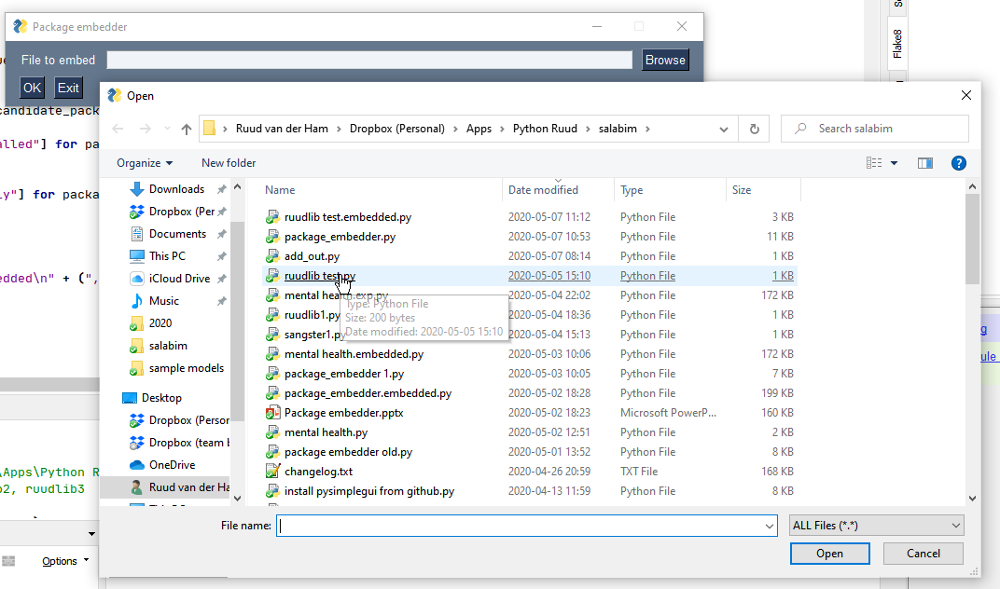
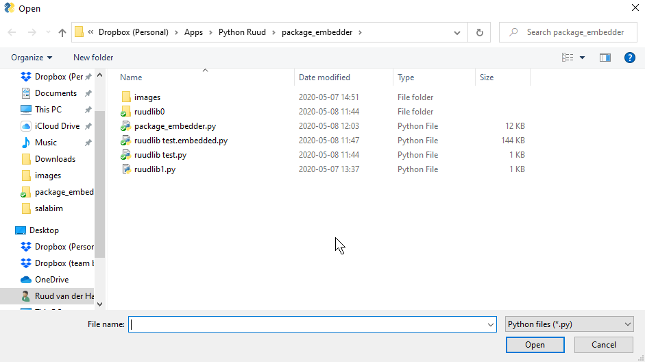
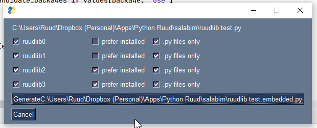
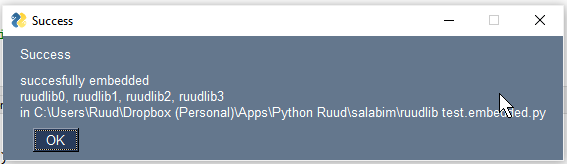

# package_embedder
## Introduction
The program *package_embedder* can be used to embed pure Python packages in
- a script
- a module

That means that the user of the program or script doesn't have to install the packages or it is
guaranteed that a specific version of a package is used.  
The main purpose of *package embedder* is to make distribution of programs or packages with dependencies possible without
installing those packages.

Embedding a package(s) has some consequences:
- the file becomes bigger (appr. 25% of type size of the package source)
- loading the file may take longer
- one or more directories (called `embdedded <package>` are created in the system temporary that are not automatically removed.
The directory will be reused however upon loading the same package. 

The program can be used as an API or via the GUI.

## GUI
The GUI is started by running the program.
This will show a file selection dialog:


Here the user can select a Python file in which one or more packages have to be embedded.  
When the user presses the Browse button a file selection popup will make it possible to easily select a file:


If there are no embeddable packages imported in the selected file, a popup will appear.

After selecting a file, the program shows a window, like:



By default all embeddable packages will be selected. The user can now deselect one of more packages.

The field *prefer_installed* can be used to indicate that at run time an already present version of that package
will be used. If *prefer_installed* is deselected (default), the embedded version will be used anyway.

If there are non .py files in a package, a field *py_files_only* is shown (ticked by default, meaning that only .py files will be copied. If the package has also 
useful non .py files (like fonts or images), deselect this field.

When ready, the Generate button can be used to generate the output file. This file is always stored in the same folder as
the input file and will have the extension *.embedded.py* instead of *.py*. So the embedded version of *ruudlib test.py* is *ruudlib test.embedded.py*.

If the file is written correctly, a popup will confirm that:


## API  
There are two functions in package_embedder
- `embed_package`
to be used to embed one of more packages in a given .py file.  
the function has the following docstring  
```
    build outfile from infile with package(s) as mentioned in package embedded

    Arguments
    ---------
    infile : str or pathlib.Path
        input file

    package : str or tuple/list of str
        package(s) to be embedded

    prefer_installed : bool or tuple/list of bool
        if False (default), mark as to always use the embedded version (at run time)
        if True, mark as to try and use the installed version of package (at run time)
        if multiple packages are specified and prefer_installed is a scalar, the value will
            be applied for all packages

    py_files_only : bool or tuple/list of bool
        if True (default), embed only .py files
        if False, embed all files, which can be useful for certain data, fonts, etc, to be present
        if multiple packages are specified and py_files_only is a scalar, the value will
            be applied for all packages

    outfile : str or pathlib.Path
        output file
        if None, use infile with extension .embedded.py instead of .py

    Returns
    -------
    packages embedded : list
        when a package is not found or not embeddable, it is excluded from this list

```
- `get_embeddable_pacakes` used to get all embeddable packages in a given .py file  
the function has the following docstring  
```
    get all embeddable packages in a given file

    Arguments
    ---------
    infile : file or pathlib.Path
        file to be scanned for embeddable packages

    Returns
    -------
    embeddable packages in infile : list
        [] if no embeddable packages are found in infile
```
Example usage
```
embed_package("ruudlib test.py", package=("ruudlib0", "ruudlib1"), prefer_installed=True))
```

## Internals
This how *package_embedder* gets the embeddable packages
- the program checks for occurrences of lines with an `import <package>' or `from <package> import`
- for each of the `<package>`s it will try and find a matching installation in the folders 
in `sys.path`
- only the current working directory and folders ending with  `site-packages` are considered
- folders need  to contain a `__init__.py` file
- some packages (numpy, PIL, scipy, pandas, cv2) will be excluded automatically
    
The actual embedding works as follows
- if any package is to be embedded, a function `copy_contents` will be added at the front of
the output file
- for each package to be embedded a line `copy_content(...)` will be added
- the `copy_contents` call will include the package name, a prefer_installed flag and a list of all
filenames and their encoded, zipped contents to be copied to the target directory

At run time:
- the `copy_contents` function will create a directory `embedded <package>` in the temporary folder.
- All files as given will be unzipped, and decoded and written in that directory.
- When `prefer_installed` is True, the created folder will be added at the end of `sys.path`  
When `prefer_installed` is False, the created folder will be added to the front of `sys.path`

For the GUI, *package_embedder* uses the excellent *PySimpleGUI* package.  
If you don't want to or can't install *PySimpleGUI*, use *package embedder.embedded.py*.
