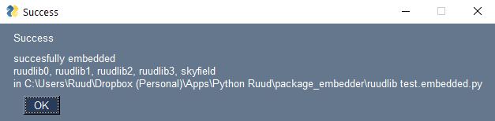

# package-embedder
The program *package_embedder* can be used to embed pure Python packages in
- a script
- a module

That means that the user of the program or scripy doesn't have to install the packages or it is
guaranteed that a specific version of a package is used.

The program can be used as an API or via the GUI.

API  
Many

test
