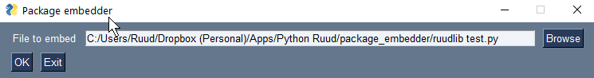

# package_embedder
## Introduction
The program *package_embedder* can be used to embed pure Python packages in
- a script
- a module

That means that the user of the program or scripy doesn't have to install the packages or it is
guaranteed that a specific version of a package is used.

The program can be used as an API or via the GUI.

## GUI
The GUI is started by running the program.
This will show a file selection dialog:

Here the user can select a Python file in which one or more packages have to be embedded.  

If there are no embeddable packages imported in the selected file, a popup will appear.

After selecting a file, the program shows a window, like:

By default all embeddable packages will be selected. The user can now deselect one of more packages.  
The field *prefer_installed* can be used to indicate that at run time an already present version of that package
will be used. If *prefer_installed* is deselected (default), the embedded version will be used anyway.  
The field *py_files_only* is selected by default, meaning that only .py files will be copied. If the package has also 
useful non .py files (like fonts or images), deselect this field.  
When ready, the Generate button can be used to generate the output file. This file is always stored in the same folder as
the input file and will have the extension *.embedded.py* instead of *.py*. So the embedded version of *ruudlib test.py* is *ruudlib test.embedded.py*.

## API  
There are two Many

test
